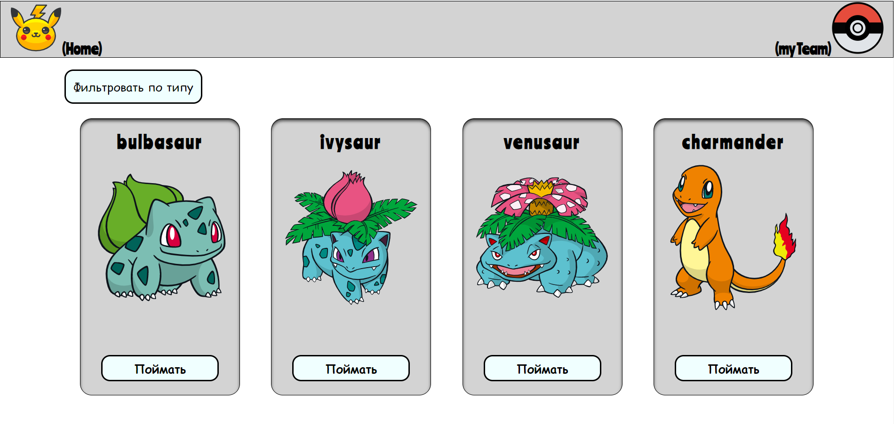
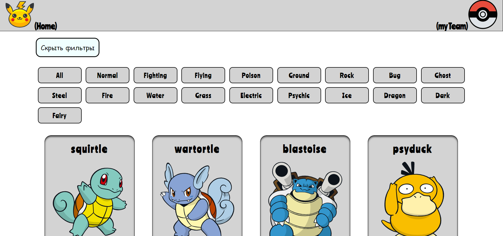
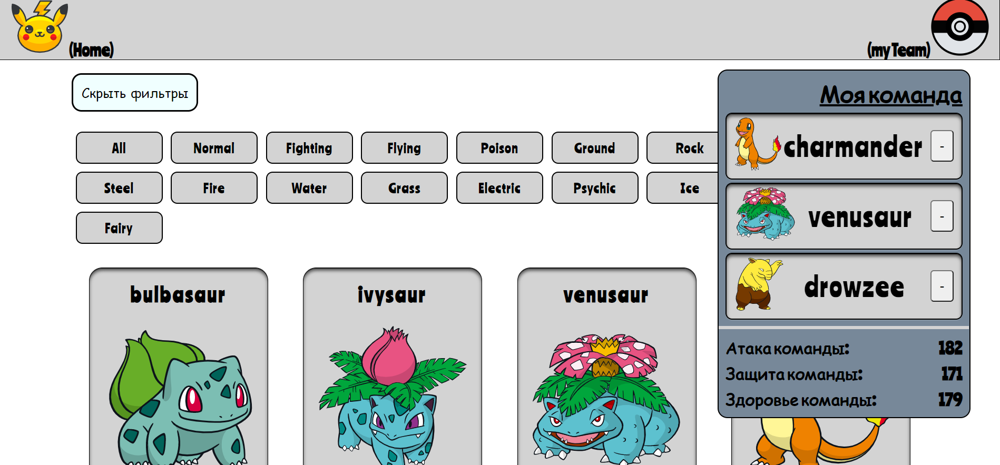
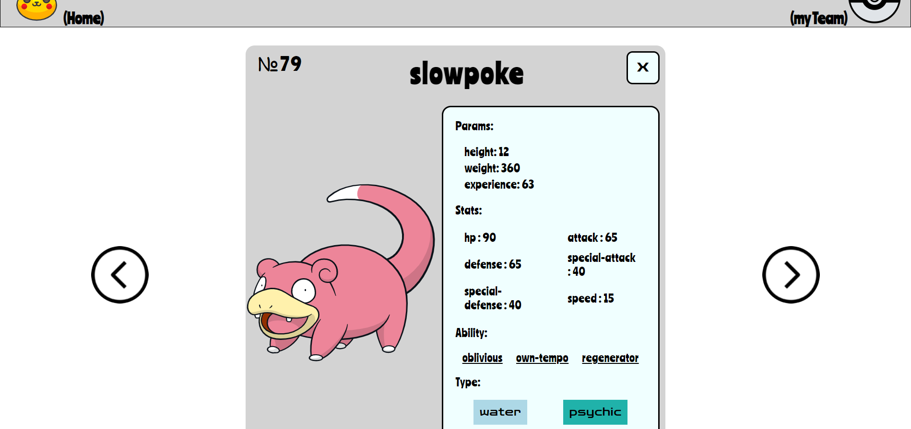

Приложение было написано для изучения React + хуков. Данные получены с https://pokeapi.co/
Я использовал:
- useEffect, useState,useContext, useRef
- Асинхронная загрузка данных
- Библиотека react-router

### Screenshots
## **Главная страница**

## **Фильтрация**

## **Моя команда**

## **Подробрная карта покемона**

### Бонус :)
Чтобы мир спасти от разрушенья!
Чтоб сплотить всё наше поколенье!
Чтобы правду и любовь изжить!
Чтоб вершин достичь в бой идём мы:
Джесси!
Джеймс!
**Команда Р** на службе зла!
Выбор твой: сдавайся или же сражайся!
Мяу! И это факт!
